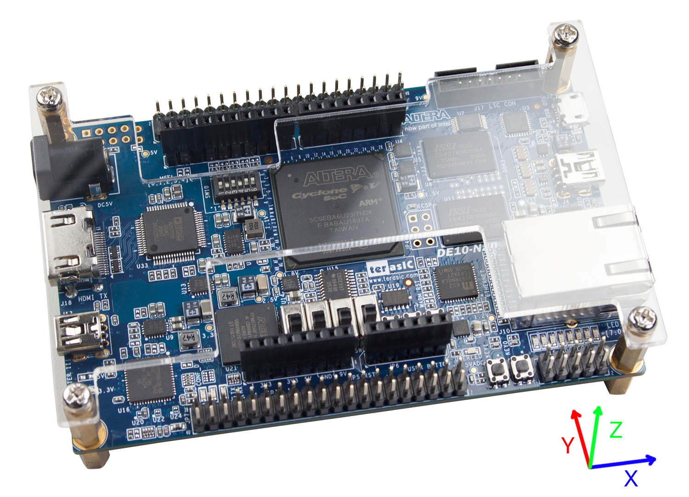

# Capture and Plot Accelerometer Data

[//]: # (This syntax works like a comment, and won't appear in any output.)

## Purpose and Overview
Data from the DE10-Nano's built-in 3-axis accelerometer is measured on ALL 3 axes to show when the board is in motion. The raw output of the accelerometer is converted to g-force values by a sensor library and then sent to graphing software for data visualization and interpretation.

[//]: # (Remove learn how to use opkg item okay?)


In this tutorial you will:
* Interface with the board's built-in digital accelerometer using an I2C\* interface.
* Use Intel’s I/O and sensor libraries (MRAA and UPM) to get data from the accelerometer.
* Learn how to use opkg to install additional software libraries and tools.
* Monitor and observe acceleration data for small vibration and movement along the x, y, z axes.
* Translate the acceleration data into +/- g-force values to demonstrate the motion of the DE10-Nano board.
* Show the accelerometer data using different open-source technologies: 
  * Express\* (web server)
  * Plotly\* (graphing library)
  * Websockets\*(data stream).

**Note**: Both Express.js and Plotly.js are non-restrictive MIT licensed technologies.

## Materials

### Hardware
* [Terasic DE10-Nano Development Board](https://www.terasic.com.tw/cgi-bin/page/archive.pl?Language=English&CategoryNo=205&No=1046&PartNo=8)
* Ethernet cable
* Router

### Software

[//]: # (For getting a tilt/orientation vector you would need to do a bit of trigonometry on the accelerometer data and that is not shown here.)

[//]: # (This syntax works like a comment, and won't appear in any output.)

#### Libraries
[//]: # (Dalon helped to build out the below descriptions.)

* MRAA

MRAA is an I/O library (abstraction layer) that creates a common interface across plaforms to access various I/O. Here MRAA is used to access the I2C interface connected to the accelerometer.

* UPM

UPM is a sensor library that provides software drivers for a wide variety of commonly used sensors including the DE10-nano's on-board accelerometer. These software drivers interact with the underlying hardware platform through calls to MRAA APIs. In this tutorial, the UPM library is used to read data from the board's built-in 3-axis digital accelerometer, the ADXL345 from Analog Devices.

**Note**: MRAA and UPM come pre-installed on the default DE10-Nano microSD card image.

#### Programming Language
Node.js\*

## Accelerometer Theory

### Speeding Up, Slowing Down, Changing Direction
How does your smart phone know which way is up? And how does it know to change its orientation from portrait to landscape when you rotate your device by 90 degrees clockwise? These motion smart features come courtesy of an accelerometer. An accelerometer is a sensor that measures acceleration (relative to its own frame of reference). You may remember from physics what when velocity—speed with direction—is changing, acceleration is happening. Acceleration includes speeding up, slowing down or changing direction and by detecting changes in orientation (along the x, y, and z axes) an accelerometer...

There are two ways to use an accelerometer: acceleration and tilt. Here we use a 3-axis accelerometer to measure acceleration along all 3 axes (x, y, and z).

### Communicating with the Accelerometer

Here, we interface with the board's built-in digital accelerometer using an I2C\* interface. The I2C bus is physically wired up to the ARM\* processor on the SoC. 

## Tutorial Steps
Follow along with the steps below to get data from the DE10-Nano's built-in accelerometer and plot that data in graphing software.

1. [Prepare the DE10-Nano development board to host the accelerometer application](readme.md#step-1-prepare-your-de10-nano)

[//]: # (2. Build and install the MRAA and UPM libraries on the de10-nano board removed -- Dalon plans to release new versions semi-annually)

[//]: # (java bindings are not enabled for the pre-installed packages. And the reason, the version of Angstrom we are using... the java packages don't compile)

2. [Clone the GitHub\* repository](readme.md#step-2-clone-the-github-repository)

3. [Install Express\*, Websocket\* and Plotly\*](readme.md#step-3-install-express-websocket-and-plotly)

4. [Setup an Express.js Web server](readme.md#step-5-setup-an-expressjs-webserver)

5. [Unbind the ADXL345\* Driver](readme.md#step-4-unbind-the-adxl345-driver)

6. [Generate a real-time plot using Plotly\*](readme.md#step-6-generate-a-real-time-plot-using-plotly)

7. [Observe the types of forces acting on the board](readme.md#step-7-observe-the-types-of-forces-acting-on-the-board)

[//]: # (Dalon installed node.js and npm on the microSD card)

## Step 1: Prepare your DE10-Nano

#### Checkpoint: Have you gone through the initial assembly and setup of the DE10-Nano board?
At this point, we assume you've already gone through the initial assembly and setup for the DE10-Nano kit. The microSD card that came with the Terasic\* DE10-Nano kit should be inserted into the board's microSD card slot and your board should be powered on. Go through the assembly and setup process first!

For instructions on board assembly and setup, check out the [DE10-Nano Setup](https://software.intel.com/en-us/de10-nano-setup) from the DE10-Nano Get Started Guide.

### Connect the Board to the Internet

First connect the DE10-Nano board to the internet and get a static IP.

**Note**: Newer versions of the DE10-Nano image will contain drivers for most USB Wi-Fi dongles. Unfortunately this exercise does not cover setting up a wireless connection.

[//]: # (Reason we need to connect to the internet is to do opkg.)

[//]: # (Most importantly to do a git clone on the source code for this tutorial.)

1. Run an Ethernet cable from the DE10-Nano board to a router.

**Note**: There are two different network interfaces on the DE10-Nano board: 1) Ethernet interface (ETH0) and 2) USB RNDIS (Ethernet over USB, interface USB0). In this exercise we use the Ethernet interface.

[//]: # (point user to page in IDZ book to avoid duplication of instructions)

#### Get a static IP

Serial connection using terminal.

[//]: # (Tudor, we open up a terminal window or shell first?)


Run the following command to force a static IP on the eth0 interface with connman:

`connmanctl config ethernet_000000000000_cable --ipv4 manual <device_ip> <subnet_mask> <gateway_ip>`
 
| Variable | Description | Example |
| --- | --- | --- |
| <device_ip> | the IP address you want to assign to the DE10-Nano | 192.168.1.10 |
| <subnet_mask> | bit mask to determine what subnet the IP address belongs to | 255.255.255.0 |
| <gateway_ip> | gateway/router IP address | 192.168.1.1 | 


By default, the Ethernet interface on the board is set to Dynamic Host Configuration Protocol (DHCP) mode, thus it will automatically ask for an IP address from the router that the board was plugged into.

The process of connecting to the DE10-Nano and hosting the graphing webpage is made a lot easier by configuring the router to assign a static IP to the board (based on the MAC address of the Ethernet interface).

Most modern routers are able to do this even with DHCP assignment turned on. By setting a static IP you won't have to edit the client configuration every time you are assigned a new IP address by the router.

##### Return to DHCP mode (optional)
If you need to revert the changes made to the ETH0 interface and return to using DHCP mode, type the command:
`connmanctl config ethernet_000000000000_cable --ipv4 dhcp`

#### Remote SSH connection
Now that you have a static IP, we can switch over to an SSH connection. Using an SSH connection will be faster, more secure and allows for file transfer to and from the board. This will be useful if you want to change the plot settings (remove one of the axes, add small data points, change the curve, etc.). This will also allow you to change the project files on the board after running the sample application.

The guide assumes that so far you have been using a Serial connection to the board to perform the initial setup. To connect to the board via SSH you will need a client like Putty or TeraTerm. You should also setup a password for the root account, by running the `passwd` command.

## Step 2: Clone the GitHub/* Repository

[//]: # (Express, Websockets, and Plotly are not on the microSD card but they get pulled in when you run npm install)

[//]: # (Plotly graph viewed on the host PC or your laptop)

Cloning the Github repository which includes the source code for this sample is a straightforward process. The Git client is part of the DE10-Nano image.
To clone the repository type the following command in your SSH session:

```
git clone https://github.com/intel-iot-devkit/terasic-de10-nano-kit.git
```

This will create a new folder named `terasic-de10-nano-kit` in the current directory.
The source code files for the accelerometer tutorial can be found under `terasic-de10-nano-kit/code-samples/accelerometer/de10-adxl345`.

## Step 3: Install Express\*, Websocket\* and Plotly\*

Enter the application directory by typing:

```
cd terasic-de10-nano-kit/code-samples/accelerometer/de10-adxl345
```

When using the sample code from this repository, Express, Websocket and Plotly will get installed by running:

```
npm install
```

[//]: # (Make a note that these packages come pre-installed on the default sd card image but... you can okpg technologies into your development enviroment. You can learn how to use opkg here!)

## Step 4: Unbind the ADXL345\* Driver

By default Linux/* is bound (i.e., "owns") this accelerometer device. Here, we'll need to "unbind" the device from Linux in order to use it for our program. Wrestle that control away from Linux.

By default the adxl34x driver will bind with device 0-0053, you can see that in the directory listing below:

```
root@de10-nano:~# ls /sys/bus/i2c/drivers/adxl34x
0-0053  bind    uevent  unbind 
```

The adx34x kernel driver polls the accelerometer continuously and it will interfere with the MRAA library. Furthermore, it enables
the auto-sleep feature on the ADXL345, which in turns adds significant delay when reading the values with the UPM driver.

First, reconfigure the device:

```
root@de10-nano:~# echo 0 > /sys/bus/i2c/drivers/adxl34x/0-0053/autosleep
root@de10-nano:~# echo 15 > /sys/bus/i2c/drivers/adxl34x/0-0053/rate

```

To unbind the driver you echo the device name to the unbind psuedo file in the sysfs like this:

```
root@de10-nano:~# echo 0-0053 > /sys/bus/i2c/drivers/adxl34x/unbind
```

Notice that the device is no longer present in this directory:

```
root@de10-nano:~# ls /sys/bus/i2c/drivers/adxl34x                    
bind    uevent  unbind 
```

To bind the device you echo the device name to the bind pseudo file in sysfs like this:

```
root@de10-nano:~# echo 0-0053 > /sys/bus/i2c/drivers/adxl34x/bind    
[  871.268013] input: ADXL34x accelerometer as /devices/platform/soc/ffc04000.i2c/i2c-0/0-0053/input/input5
```

Notice that the device is back:

```
root@de10-nano:~# ls /sys/bus/i2c/drivers/adxl34x                 
0-0053  bind    uevent  unbind 
```

**Note**: Rebinding the driver is required in case you want to run other accelerometer samples. (Hint: There maybe an accelerometer Easter egg hiding on the microSD card image... Go hunt for it!).
Driver changes are not persistent after a reboot.

## Step 5: Setup an Express.js Webserver

This webserver uses WebSockets\* to push live data captured from the accelerometer to the client's browser.

### Set the Node.js module lookup path

Before we start the server, let's make sure Node.js knows where to find MRAA and UPM. To do this, we'll set the `NODE_PATH` environment variable:

```
export NODE_PATH=/usr/lib/node_modules
```

If you want to make this change permanent and have the `NODE_PATH` variable exported every time the board boots, use the following command:

```
echo "export NODE_PATH=/usr/lib/node_modules" > ~/.profile
```

### Start the Web server

Server side code is in the `app.js` file. This file was generated using an Express.js template and then extended to handle a WebSockets connection. More information on both
concepts can be found under references. The server will also send accelerometer data periodically using the UPM ADXL345 library, as explained in the next section.

Client side code can be found in the `public/js/index.js` file. On the client side, you will need to set the IP address of the DE10-Nano board:

```js
var connection = new WebSocket('ws://192.168.1.10:3001'); // Change to match your own DE10-Nano IP
```

You can use the built in `vi` editor to make the change. You are now ready to start the server.

[//]: # (note that there is another editor in the event that you hate/disklike vi. Dalon knows that other editor option. Ask him. It's a GUI based editor that can be used.)

Starting Express\* is as simple as typing the following command:

```
npm start
```

## Step 6: Generate a Real-time Plot Using Plotly\*

The Plotly\* graphing library is used to visualize the data in the form of a real-time plot. The page is accessible from almost any browser/device combo.

To view the graph, use any device connected to the same network as the DE10-Nano board, open a browser, and go to:

```
http://<device_ip>:3000
```

There are a few key components to this application that allow reading data from the accelerometer and pushing it to the client.

On the server side, you'll need to load the UPM library for the ADXL345 and read the g-force values. This is reflected by the following code:

```js
var upm = require('jsupm_adxl345'); // Assumes the UPM modules are installed on a path known to Node.js, or a location specified via the NODE_PATH environment variable
```

And

```js
var adxl = new upm.Adxl345(0); // Initialize the accelerometer on I2C bus 0

var gatherData = setInterval(function() {
    adxl.update(); // Update the data
    var force = adxl.getAcceleration(); // Read acceleration force (g)
    force.setitem(2, (force.getitem(2) + 0.08)); // Apply a small offset to the Z axis, determined by calibration

    // Serialize and send the accelerometer data as JSON
    connection.send('{"x": ' + force.getitem(0).toFixed(2) + ', "y": ' + force.getitem(1).toFixed(2) + ', "z": ' + force.getitem(2).toFixed(2) + '}');
}, 100); // Send the data every 100 ms
```

For the client side, first synchronize the number of messages sent by the server per second:

```js
var messagesPerSecond = 10; // Change to match your server data rate
```

Then, we deserialize the JSON acceleration data received from the server and update the plot:

```js
connection.onmessage = function (message) {
    // Parse data and push data to plot
    try {
        var adxlData = JSON.parse(message.data); // Deserialize incoming JSON acceleration data

        // Divide the X axis by the number of messages received per second, so that major units are elapsed seconds
        var ts = messagesReceived/messagesPerSecond;

        var newData = {
            x: [[ts], [ts], [ts]],
            y: [[adxlData.x], [adxlData.y], [adxlData.z]]
        }

        // Extend the current graph, last integer here is the number of X values to keep before discarding old data
        Plotly.extendTraces('myDiv', newData, [0, 1, 2], 60 * messagesPerSecond);
        messagesReceived++;
    } catch (e) {
        console.log('This doesn\'t look like valid JSON: ', message.data);
        return;
    }
};
```

The rest of the client side code defines the style of the graph according to the Plotly API.

Keep in mind that the current setup will refresh the data approximately 10 times a second. Feel free to try different values to show more or less data.

## Step 7: Observe the Types of Forces Acting on the Board

[//]: # (Tudor to add board + axes overlay -- give Tudor spcm graphics folder URL)
[//]: # (Do we/can we calibrate this thing?)




### Static Forces
* Gravity

[//]: # (z axis when board is resting on its rubber feet. The force of gravity is always shown on the graph: 1g or 9.8 m/s^2.)

### Dynamic Forces

[//]: # (Tudor to add GIF)

1. Movement
* Motion along the x, y, and z axis

2. Vibration

[//]: # (Future item. Bob's idea is to have something vibrate the board -- a constant vibration preferred -- and then feed into the FFT and it converts that time domain into frequency. Pure software project. No hardware.)

The sensitivity of accelerometers... by gently tapping the board... we can observe tiny minute changes in acceleration...

* Tapping the board
* Drumming on on the table

Make sure the silicon rubber feet are attached to the copper standoffs when you...!

## Further Steps and Optimizations

On a PC or laptop, Plotly makes use of hardware acceleration (via webGL) for rendering the charts. Therefore you can work with large datasets, redraw often, and still be able to show responsive
graphs. Unfortunately, this feature is unavailable on mobile browsers (e.g. tablets, smartphones). This means the plotting rate is directly impacted and limited to only a few updates per second
(1 to 4) for these devices. The good news is that the amount of data you can send over WebSockets is not affected.

A natural optimization would be to collect the data points in buffers on the client side, while continuing to send them at a high rate from the DE10-Nano. You can then update the graph with
several values at once and still keep the graph responsive even on mobile devices.

## Conclusion

This exercise shows how easy it is to integrate the MRAA and UPM libraries with other technologies towards building a full IoT application. Many other sensors and actuator libraries,
including several rated for industrial use are also available. For a full list of supported sensors please visit the UPM API pages [here](http://iotdk.intel.com/docs/master/upm/modules.html).

## References
 * MRAA: http://mraa.io
 * UPM: http://upm.mraa.io
 * OPKG: https://wiki.openwrt.org/doc/techref/opkg
 * Express.js: https://expressjs.com/
 * Websocket.js: https://github.com/theturtle32/WebSocket-Node
 * Plotly.js: https://plot.ly/javascript/

Some nice Plotly examples on how to extend graphs with new data:
 * http://codepen.io/plotly/pen/LGEyyY
 * http://codepen.io/etpinard/pen/qZzyXp
